# Node2AI Comprehensive Architecture

## Executive Summary

Node2AI is a comprehensive enterprise AI orchestration platform designed for regulated industries (healthcare, finance, government). It provides a unified interface for multiple AI providers while maintaining strict data privacy, compliance, and audit trail requirements through blockchain technology.

**Key Capabilities:**

- Multi-provider AI orchestration (OpenAI, Anthropic, Google, Perplexity, Local)
- Advanced data sanitization (PII, PHI, Financial, Government)
- Immutable audit trails via Hyperledger Fabric blockchain
- Enterprise-grade security and compliance (HIPAA, GDPR, SOX)
- Real-time analytics and monitoring
- BYOK (Bring Your Own Key) architecture

---

## System Architecture Overview

### High-Level Architecture

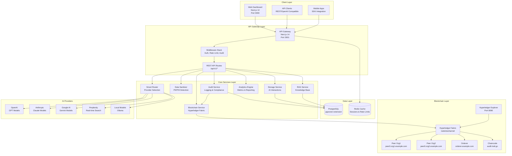

### PlantUML Version

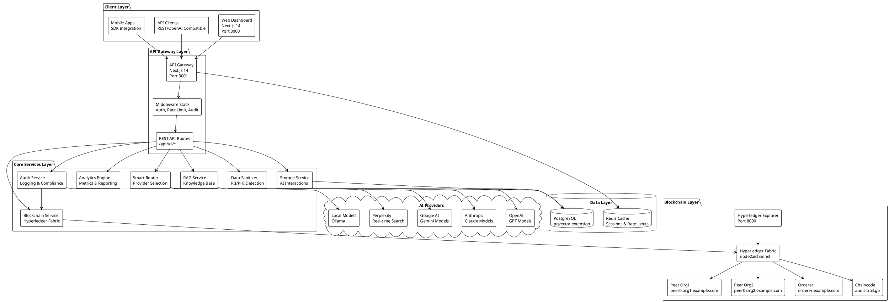

---

## Detailed Component Architecture

### Frontend Layer (Presentation)

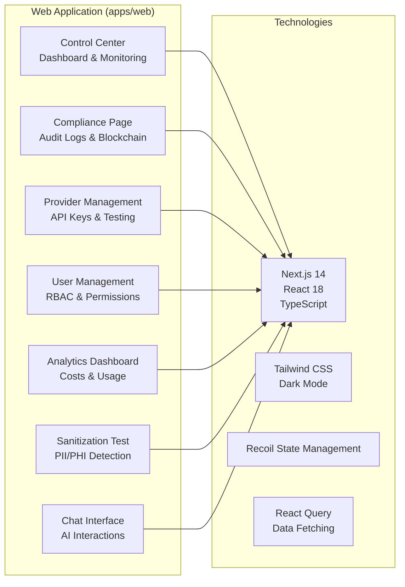

**Key Components:**

- **Control Center** (`/`): Real-time system monitoring, health checks, active requests
- **Compliance Page** (`/compliance`): Audit logs, blockchain transaction viewer, PHI detection
- **Provider Keys** (`/providers`): API key management for AI providers
- **Test Sanitization** (`/test-sanitization`): Interactive PII/PHI detection testing
- **User Management**: Role-based access control, organization management

---

### API Gateway Layer

```mermaid
graph TB
    subgraph "API Gateway (apps/api)"
        subgraph "Request Flow"
            IN[Incoming Request]
            MIDDLEWARE[Middleware Chain]
            ROUTE[API Route Handler]
            SERVICE[Service Layer]
            RESPONSE[Response]
        end

        subgraph "Middleware Stack"
            AUTH[Auth Middleware<br/>JWT/API Key]
            RATE[Rate Limit Middleware<br/>Redis-backed]
            AUDIT_MW[Audit Log Middleware<br/>Request Logging]
            LICENSE[License Middleware<br/>Feature Gating]
            CORS[CORS Middleware<br/>Cross-Origin]
        end

        subgraph "API Routes (v1)"
            CHAT[/chat/completions<br/>AI Interactions]
            BLOCKCHAIN[/blockchain/audit/*<br/>Blockchain Queries]
            ANALYTICS_ROUTE[/analytics/*<br/>Metrics & Stats]
            PROVIDERS_ROUTE[/provider-keys/*<br/>Key Management]
            CONTROL_ROUTE[/control-center/*<br/>System Status]
            SANITIZE_ROUTE[/sanitization/*<br/>Data Sanitization]
        end
    end

    IN --> MIDDLEWARE
    MIDDLEWARE --> AUTH
    AUTH --> RATE
    RATE --> AUDIT_MW
    AUDIT_MW --> LICENSE
    LICENSE --> CORS
    CORS --> ROUTE
    ROUTE --> CHAT
    ROUTE --> BLOCKCHAIN
    ROUTE --> ANALYTICS_ROUTE
    ROUTE --> PROVIDERS_ROUTE
    ROUTE --> CONTROL_ROUTE
    ROUTE --> SANITIZE_ROUTE
    CHAT --> SERVICE
    SERVICE --> RESPONSE
```

**Key API Endpoints:**

- `/api/v1/chat/completions` - OpenAI-compatible chat completions
- `/api/v1/blockchain/audit/[requestId]` - Blockchain transaction queries
- `/api/v1/analytics/*` - Usage analytics and metrics
- `/api/v1/provider-keys/*` - AI provider key management
- `/api/v1/control-center/*` - System monitoring endpoints
- `/api/v1/sanitization/*` - Data sanitization services

---

### Core Services Layer

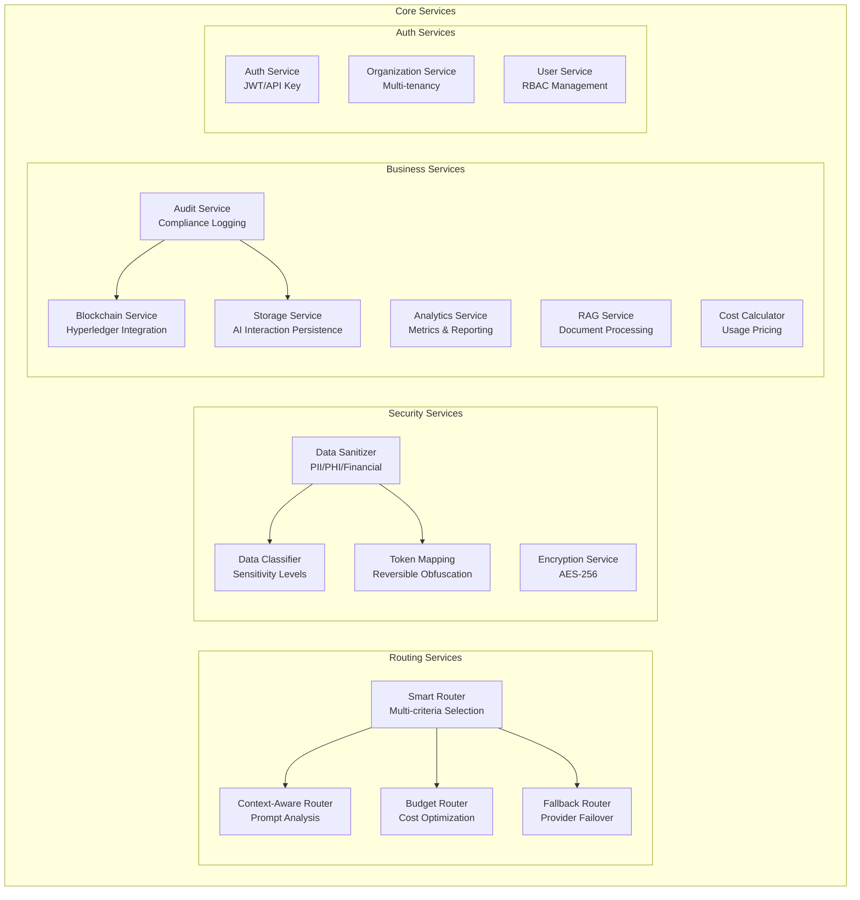

---

### Data Layer Architecture

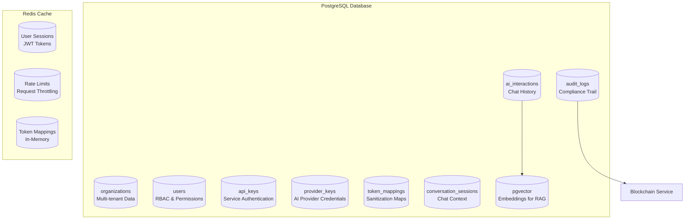

**Database Schema Highlights:**

- **Organizations**: Multi-tenant isolation, license management
- **Users**: Role-based access (admin, operator, viewer, auditor)
- **API Keys**: Service-to-service authentication
- **Provider Keys**: Encrypted AI provider credentials (BYOK)
- **Audit Logs**: Comprehensive activity tracking
- **AI Interactions**: Complete chat history with sanitization states
- **Token Mappings**: Reversible PII/PHI obfuscation
- **pgvector**: Vector embeddings for RAG capabilities

---

### Blockchain Integration Architecture

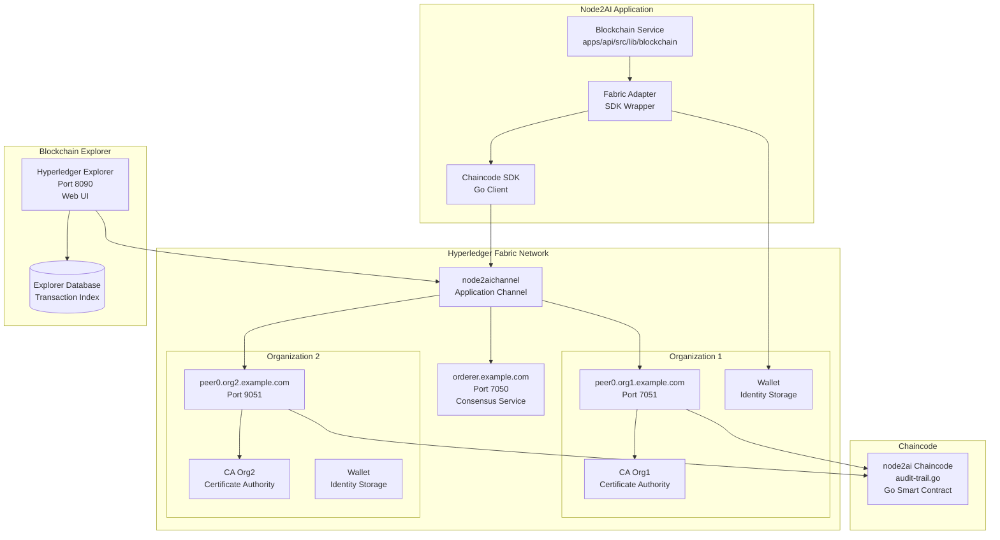

**Blockchain Components:**

- **Network**: `node2aichannel` with 2 organizations (Org1, Org2)
- **Chaincode**: `node2ai` version 1.1 (audit-trail.go)
- **Identity Management**: Wallet stores `appUser` identity
- **Transaction Flow**: RecordInteraction → QueryInteraction → Compliance Verification
- **Explorer**: Real-time transaction viewer and blockchain state

---

## Data Flow Diagrams

### Chat Completion Request Flow

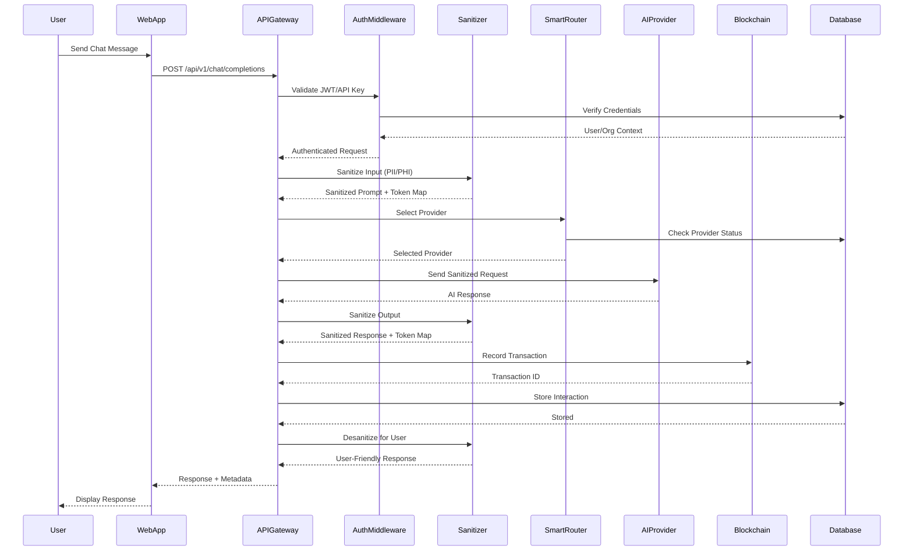

### Blockchain Recording Flow

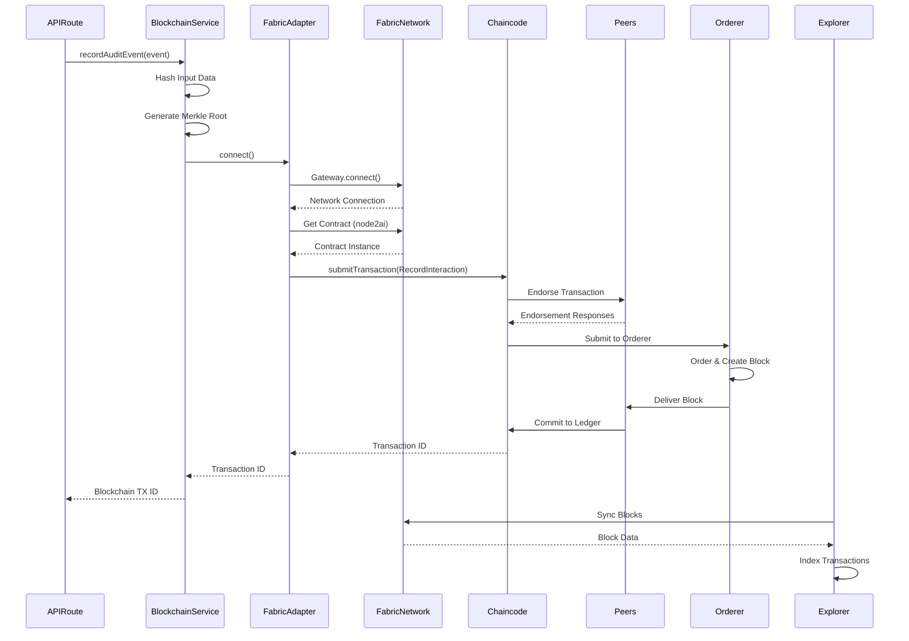

---

## Technology Stack

### Frontend Stack

- **Framework**: Next.js 14 (App Router)
- **UI Library**: React 18
- **Language**: TypeScript 5+
- **Styling**: Tailwind CSS (Dark Mode)
- **State Management**: Recoil
- **Data Fetching**: React Query
- **Charts**: Recharts

### Backend Stack

- **Framework**: Next.js 14 (API Routes)
- **Language**: TypeScript 5+ (Strict Mode)
- **Runtime**: Node.js 18+
- **Package Manager**: pnpm 8+

### Data Stack

- **Primary Database**: PostgreSQL 15+ with pgvector extension
- **Cache**: Redis 7+ (Sessions, Rate Limiting)
- **Native Auth**: Password hashing (bcrypt) + JWT-based sessions stored in PostgreSQL

### Blockchain Stack

- **Framework**: Hyperledger Fabric 2.5
- **Network**: Test Network (Development) / Production Network
- **Chaincode**: Go 1.21+
- **SDK**: Fabric Node.js SDK
- **Explorer**: Hyperledger Explorer 2.0

### AI Provider Integrations

- **OpenAI**: GPT-4, GPT-3.5-turbo
- **Anthropic**: Claude 3 (Opus, Sonnet, Haiku)
- **Google**: Gemini Pro, Gemini Ultra
- **Perplexity**: Real-time search models
- **Local**: Ollama (Llama 2, Mistral, etc.)

### Security & Compliance

- **Authentication**: JWT, API Keys, SSO (SAML, OAuth2)
- **Encryption**: AES-256, TLS 1.3
- **Data Sanitization**: Proprietary PII/PHI detection
- **Compliance**: HIPAA, GDPR, SOX ready

---

## Deployment Architecture

### Development Environment

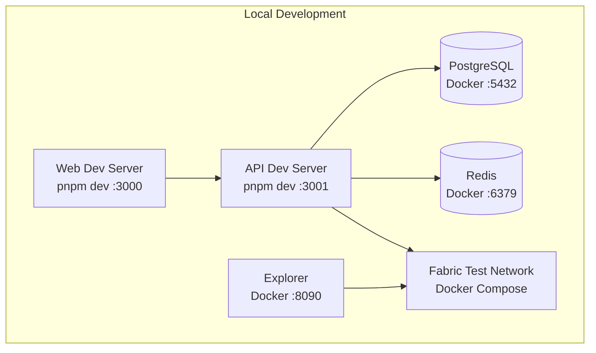

### Production Environment

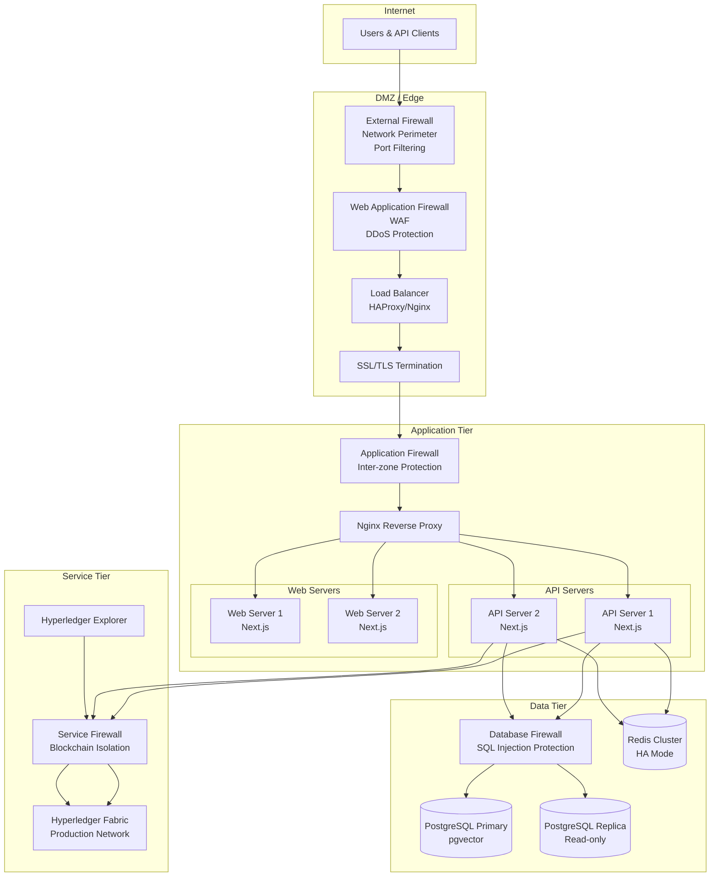

---

## Security Architecture

### Network Security & Firewalls

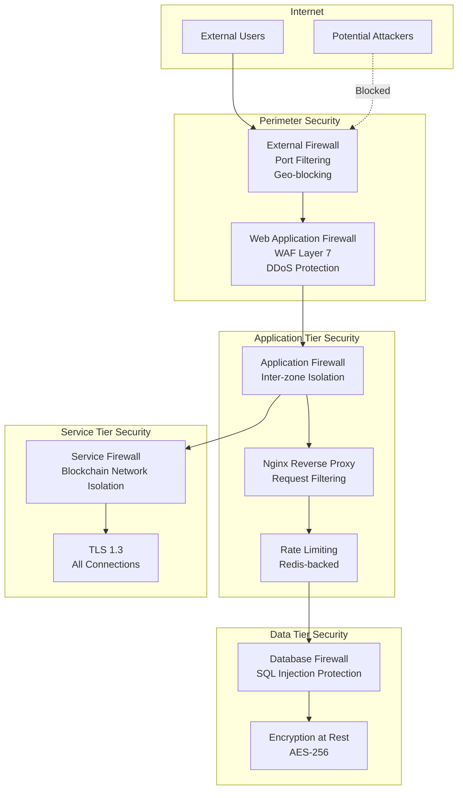

**Firewall Placement:**

1. **External Firewall** (Network Perimeter)
   - Location: Between Internet and DMZ
   - Rules: Allow HTTP (80), HTTPS (443), deny all others
   - Features: Port filtering, geo-blocking, basic rate limiting

2. **Web Application Firewall (WAF)** (DMZ)
   - Location: After external firewall, before load balancer
   - Protection: SQL injection, XSS, DDoS mitigation, bot detection
   - Examples: Cloudflare, AWS WAF, ModSecurity

3. **Application Firewall** (Application Tier)
   - Location: Between DMZ and application servers
   - Purpose: Inter-zone isolation, application-level filtering
   - Rules: Service-to-service communication control

4. **Database Firewall** (Data Tier)
   - Location: Between application servers and databases
   - Protection: SQL injection prevention, query filtering
   - Access Control: Connection limits, IP whitelisting

5. **Service Firewall** (Service Tier)
   - Location: Around blockchain network
   - Purpose: Isolate blockchain from other services
   - Rules: Blockchain-specific port controls

### Authentication & Authorization Flow

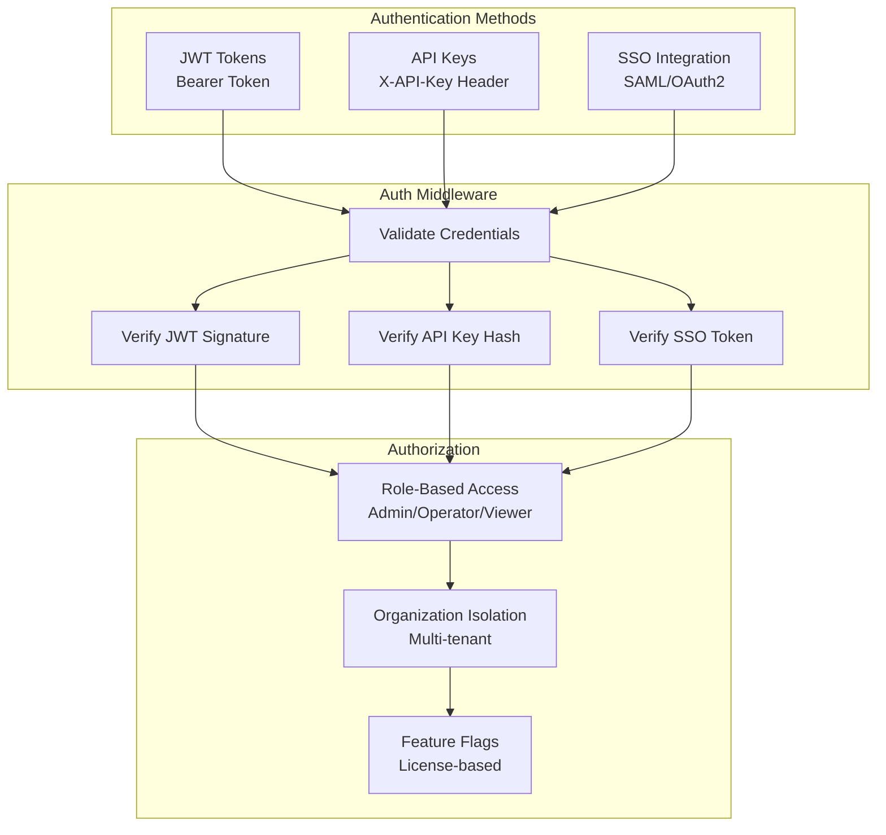

### Data Sanitization Pipeline

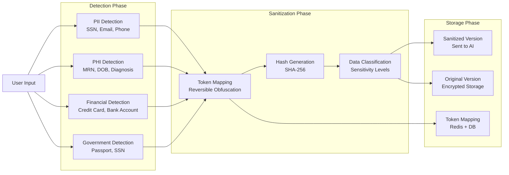

---

## Network Topology

### PlantUML Network Diagram

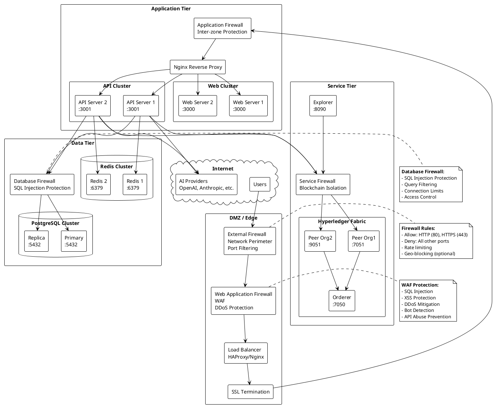

---

## Integration Patterns

### Provider Integration Pattern

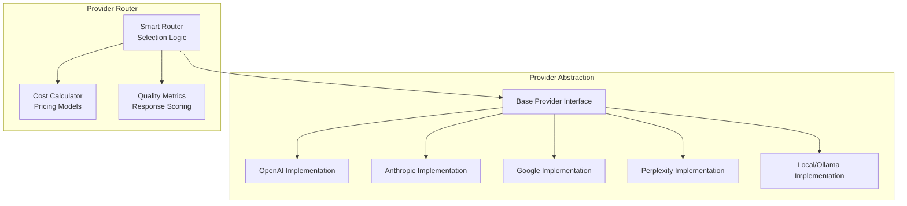

### Middleware Chain Pattern

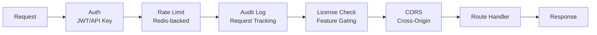

---

## Component Details

### Smart Router Service

**Location**: `apps/api/src/lib/core/router.ts`

**Responsibilities**:

- Multi-criteria provider selection (cost, quality, latency)
- Fallback routing on provider failures
- Budget-aware routing
- Context-aware provider matching

**Selection Criteria**:

1. Cost optimization
2. Quality threshold
3. Latency requirements
4. Provider availability
5. Model capabilities

### Data Sanitization Service

**Location**: `packages/sanitization/`

**Capabilities**:

- PII Detection: SSN, Email, Phone, Address
- PHI Detection: MRN, DOB, Diagnosis, Treatment
- Financial Detection: Credit Cards, Bank Accounts, Tax IDs
- Government Detection: Passport, SSN, Security Clearance

**Sanitization Methods**:

- Tokenization (reversible)
- Hashing (SHA-256)
- Encryption (AES-256)
- Pattern replacement

### Blockchain Service

**Location**: `apps/api/src/lib/blockchain/blockchain.service.ts`

**Operations**:

- `recordAuditEvent()`: Record AI interaction to blockchain
- `queryAuditEvent()`: Query transaction by requestId
- `queryAuditEventsByOrg()`: Query by organization
- `queryAuditEventsByDateRange()`: Query by date range
- `verifyPHICompliance()`: Verify HIPAA compliance

**Chaincode Functions**:

- `RecordInteraction`: Store interaction on ledger
- `QueryInteraction`: Retrieve interaction data
- `QueryInteractionsByOrganization`: Filter by org
- `QueryInteractionsByDateRange`: Filter by date
- `GetInteractionHistory`: Get full history
- `VerifyPHICompliance`: Compliance verification

### Analytics Service

**Location**: `apps/api/src/lib/analytics/engine.ts`

**Metrics Tracked**:

- Request volume and trends
- Token usage per provider/model
- Cost tracking and optimization
- Response time analytics
- Error rates and patterns
- Sanitization effectiveness
- PHI detection rates

---

## Compliance & Audit Trail

### Audit Trail Components

1. **Database Audit Logs** (`audit_logs` table)
   - All API requests
   - User actions
   - System events
   - Security events

2. **Blockchain Audit Trail** (Hyperledger Fabric)
   - Immutable AI interaction records
   - Cryptographic verification
   - Tamper-proof history
   - Compliance validation

3. **AI Interaction Storage** (`ai_interactions` table)
   - Original prompts
   - Sanitized prompts
   - AI responses
   - Desanitized responses
   - Token mappings

### Compliance Features

- **HIPAA**: PHI protection, breach notification, audit trails
- **GDPR**: Right to be forgotten, data portability, consent management
- **SOX**: Financial controls, audit trails, change management
- **SOC 2**: Security controls, availability monitoring, confidentiality

---

## Monitoring & Observability

### Health Check Endpoints

- `/api/health` - Basic health check
- `/api/v1/control-center/dashboard` - System status
- `/api/v1/control-center/system-status` - Detailed metrics
- `/api/v1/control-center/error-rate` - Error monitoring
- `/api/v1/control-center/response-time` - Performance metrics

### Metrics Collected

- Request rates and throughput
- Response times (p50, p95, p99)
- Error rates and types
- Provider availability
- Blockchain transaction success rate
- Database query performance
- Cache hit rates

---

## Deployment Configurations

### Docker Compose

**Development**: `docker-compose.dev.yml`

- PostgreSQL with pgvector
- Redis cache
- Hot reload for development

**Production**: `docker-compose.prod.yml`

- High availability configuration
- SSL/TLS termination
- Load balancing
- Health checks

### Kubernetes

**Location**: `deployments/kubernetes/`

**Components**:

- API Gateway deployment
- Web application deployment
- PostgreSQL stateful set
- Redis cluster
- Hyperledger Fabric network
- Ingress controllers
- Service mesh (optional)

---

## Data Flow Examples

### Complete Request Lifecycle

1. **User Request** → Web Dashboard
2. **Authentication** → JWT validation
3. **Input Sanitization** → PII/PHI detection & tokenization
4. **Provider Selection** → Smart router decision
5. **AI Request** → Selected provider API
6. **Response Sanitization** → Output sanitization
7. **Blockchain Recording** → Immutable audit trail
8. **Database Storage** → Complete interaction record
9. **Response Desanitization** → User-friendly output
10. **User Display** → Formatted response

### Blockchain Sync Flow

1. **Transaction Submission** → Fabric adapter
2. **Endorsement** → Multiple peers validate
3. **Ordering** → Orderer creates block
4. **Commit** → Peers commit to ledger
5. **Explorer Sync** → Real-time indexing
6. **Query Interface** → Web UI access

---

## Scalability Considerations

### Horizontal Scaling

- **API Servers**: Stateless, can scale horizontally
- **Web Servers**: Stateless, can scale horizontally
- **Redis**: Cluster mode for high availability
- **PostgreSQL**: Read replicas for read scaling
- **Fabric Network**: Multi-peer deployment

### Performance Optimization

- Redis caching for frequent queries
- Database connection pooling
- Async blockchain operations
- Batch processing for analytics
- CDN for static assets

---

## Security Best Practices

1. **Encryption at Rest**: All sensitive data encrypted
2. **Encryption in Transit**: TLS 1.3 for all connections
3. **Key Management**: Secure storage of API keys and secrets
4. **Access Control**: Role-based permissions
5. **Audit Logging**: Complete activity tracking
6. **Rate Limiting**: Prevent abuse and DDoS
7. **Input Validation**: Sanitize all user inputs
8. **Secret Rotation**: Regular key rotation
9. **Vulnerability Scanning**: Automated security scanning
10. **Compliance Monitoring**: Continuous compliance checks

---

## Future Enhancements

- Multi-region deployment support
- Advanced RAG capabilities with vector databases
- Real-time collaboration features
- Mobile SDK improvements
- Enhanced analytics dashboards
- Machine learning model fine-tuning
- Custom chaincode capabilities
- Advanced compliance reporting

---

## Conclusion

Node2AI provides a comprehensive, enterprise-grade platform for AI orchestration with built-in security, compliance, and blockchain-backed audit trails. The architecture is designed for scalability, maintainability, and regulatory compliance, making it suitable for healthcare, financial, and government sectors.

**Key Strengths**:

- Unified interface for multiple AI providers
- Advanced data sanitization and privacy protection
- Immutable blockchain audit trails
- Enterprise-grade security and compliance
- Comprehensive monitoring and analytics
- Scalable and maintainable architecture

---

_Last Updated: November 2025_
_Version: 2.0_
