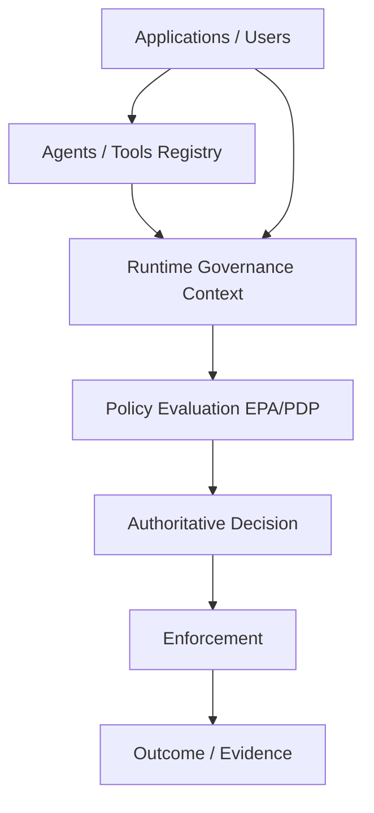
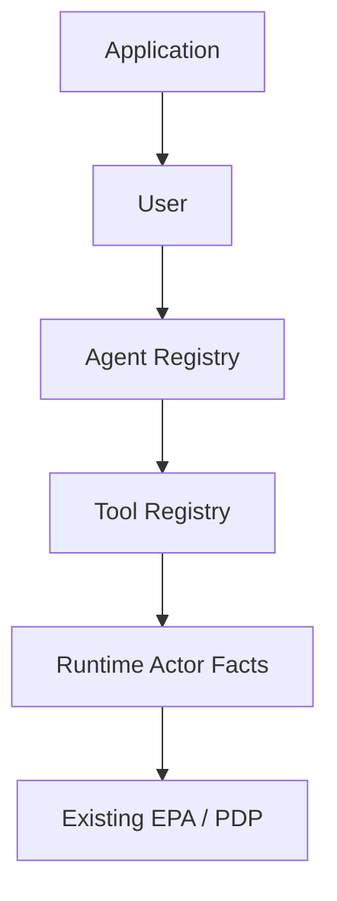
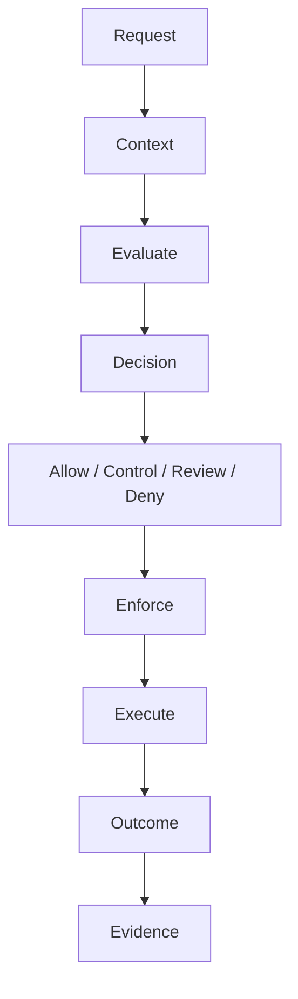

# Enigma Architecture

**Status:** Canonical (authoritative)  
**Date:** 2026-09-14  
**Scope:** Implemented architecture after Phase A and Phase B Agent/Tool Governance  
**Audience:** Product, engineering, security, and Phase D planning  

This document is the **single authoritative architectural reference** for Enigma.  
Where prior design notes conflict with this document, **this document and the repository implementation prevail**.

For how enterprise systems must call Enigma and honor Decisions / `commit_allowed` / Outcome, see **[`ENIGMA_INTEGRATION_CONTRACT.md`](./ENIGMA_INTEGRATION_CONTRACT.md)**.

Phase C is documentation and validation only. No runtime changes are implied by this text.

---

## 1. What Enigma Is

Enigma is an **AI governance gateway**. It sits between applications and AI/tool execution so that:

1. Identity and authorization **facts** are established server-side.
2. A **single policy evaluation** produces one authoritative Decision.
3. The Gateway **enforces** that Decision.
4. When required, a **human approver** resolves REVIEW without rewriting the machine Decision.
5. Execution, Outcome, and Evidence prove what was decided and what happened.

Enigma is not a model marketplace, GRC dashboard, risk-scoring product, or collection of independent policy engines.

---

## 2. Core Governance Principle

> **Registry establishes identity and authorization facts.  
> Policy determines whether an action is permitted.  
> Enforcement makes the decision real.  
> Outcome records what actually happened.  
> Evidence proves the governance chain.**

Authorization registries (Applications, Models catalog, Agents, Tools, grants) are **not** policy decision points. They supply authoritative runtime facts into the existing Enterprise Policy Authority (EPA) / Pack-Backed PDP. They do not produce independent ALLOW / DENY / REVIEW records.

---

## 3. Canonical Governance Flow

```text
Application
    ↓
User
    ↓
Agent                    (optional — when agent_id present)
    ↓
Tool                     (optional — when tool_id present)
    ↓
Runtime Actor Context    (RuntimeActorFacts when actor registry active)
    ↓
Policy                   (baseline + regulatory packs)
    ↓
EPA / PDP                (ONE evaluation)
    ↓
Authoritative Decision   (policy_evaluations)
    ↓
Enforcement              (Gateway)
    ↓
Review / Approver        (when REVIEW)
    ↓
Execution
    ↓
Outcome                  (actions path — client-reported)
    ↓
Evidence / Audit
```

### Optional paths

Not every request includes every entity.

| Example | Entities involved |
|---------|-------------------|
| Ordinary completion | Application → User → Model (via eligibility) |
| Governed agent action | Application → User → Agent → Tool → Operation → Decision → (Review) → Client commit → Outcome |
| Non-agentic request | No Agent/Tool; actor registry skipped when both IDs absent |

---

## 4. Logical Architecture



### Authorization substrate → policy



### Governance lifecycle



---

## 5. Governed Objects

### 5.1 Application

**Role:** The software principal through which AI activity enters Enigma.

**Implemented:**

- Identity: `applications` table / identity store (`application_id`, org, type, environment, status, trust, allowlists).
- Authentication: API key → `IdentityService.authenticateApiKey` binds the request to one Application and Organization.
- Deployment: installation `deployment_id` is separate from Application ID; registry and outcomes are deployment-scoped.
- Relationship to Users: Users are resolved in the Application’s organization; request body cannot spoof Application identity.
- Relationship to Agents: Agents bind to Applications via `agent_application_bindings` (ACTIVE required for substrate authorization).
- Relationship to runtime: Application facts (allowed models/operations/datasets, type, etc.) feed EPA baseline and packs.

**Boundary:** Application registration and allowlists are substrate and policy inputs — not a separate PDP.

---

### 5.2 User

**Role:** Authenticated human identity operating through an Application.

**Implemented:**

- Resolved by `IdentityService.resolveUser` from the identity store (roles/permissions from server, not client claims).
- Present on evaluations and audit as `user_id`.
- Contributes to policy context (roles, etc.).

**Critical:** The requesting User is **not** the REVIEW approver. Human authorization of held decisions is an administrative / governance-resolve capability (`governance_resolve`), not the end-user API key path.

---

### 5.3 Agent

**Role:** Autonomous or semi-autonomous runtime actor identity.

**Implemented:**

| Concern | Behavior |
|---------|----------|
| Identity | `(deployment_id, agent_id)` in `agents` |
| Lifecycle | `ACTIVE` \| `SUSPENDED` \| `RETIRED` |
| Application binding | `agent_application_bindings` — must be ACTIVE for the request Application |
| Autonomy | `autonomy_level` stored (`ASSISTIVE` \| `HUMAN_APPROVED` \| `AUTONOMOUS`); not a separate PDP |
| Operations | Agents do **not** own a declared-operations column. Permitted operations come from **Tool grants** (`allowed_operations`) against Tool-declared `operations` |
| Authorization | Substrate: registered + ACTIVE + bound → `agent.authorized` / `governance_context.agent_authorized` |
| Admin | `/agents` UI; `/v1/admin/agents*` APIs |

Agent authorization is an **input fact** to EPA. It is not an Agent Decision.

Historical Decisions retain `ai_context.runtime_actor` from evaluation time — they do **not** re-read the live registry.

---

### 5.4 Tool

**Role:** Capability an Agent may invoke.

**Implemented:**

| Concern | Behavior |
|---------|----------|
| Identity | `(deployment_id, tool_id)` in `tools` |
| Lifecycle | `ACTIVE` \| `SUSPENDED` \| `RETIRED` |
| Operations | Declared `operations[]` on the Tool — empty means no operations |
| Grants | `agent_tool_grants` with explicit `allowed_operations` (empty ≠ allow-all) and `ACTIVE` \| `REVOKED` |
| Authorization | Agent authorized + Tool ACTIVE + ACTIVE grant + operation declared + operation granted |
| Operation key | `action.kind ?? operation` |
| Admin | `/tools` UI; `/v1/admin/tools*` and grant `PUT /v1/admin/agents/:agentId/tools/:toolId` |

Tool authorization is substrate, not a Tool PDP.

---

### 5.5 Model

**Role:** Inference capability catalog and eligibility target.

**Implemented layers (do not collapse):**

| Layer | Meaning |
|-------|---------|
| Registration | Model exists in the appliance catalog (`/v1/admin/models`, model registry) |
| Eligibility | EPA Decision records which models are eligible for **this** request (`restrictions.eligible_models` / decision fields) |
| Selection | Gateway `selectEligibleModel` prefers requested if eligible, else first eligible |
| Enforcement | Ineligible / blocked paths do not call unauthorized providers |

Registration alone does **not** authorize a model for a request. Eligibility is decided by policy and evidenced on the Decision. The Admin Models page is substrate administration, not a model PDP.

Agent-scoped model allowlists are **not** implemented in the actor registry path.

---

### 5.6 Policy

**Role:** Governing rule sets evaluated by one PDP.

**Implemented:**

- **Authority:** `PackBackedEnterprisePdp` with `EnterprisePolicyAdapter` (production default engine mode `enterprise`).
- **Baseline:** Enterprise baseline interpreters (`interpretBaselineInput`, etc.), including Agent/Tool unauthorized DENY when governance context flags are false.
- **Packs / overlays:** Regulatory and framework packs contribute to the **same** evaluation (HIPAA, 42 CFR Part 2, ONC/HTI-1, CMS, NIST AI RMF, OWASP LLM, EU AI Act, ISO family, SOC 2, NIST CSF 2, NIST Privacy Framework, and related packs present in the repository).
- **Applicability:** Driven by request context (`regulatory_applicability`, domain facts, etc.) — packs that do not apply do not invent a second Decision.
- **Consequences:** Decision carries action/controls/review requirements consumed by Gateway enforcement.

Legacy DeterministicPolicyEngine remains available only when explicitly enabled (`GATEWAY_ALLOW_LEGACY_ENGINE=true` with legacy/compare modes). That is a **compatibility** posture, not the default production architecture.

---

### 5.7 Decision

**Role:** The authoritative governance determination for a request phase.

**Implemented:**

- **Store of record:** `policy_evaluations` (`PolicyEvaluationRecord`).
- **Authority:** Admin Decision UX and APIs treat `source: 'policy_evaluations'` as EPA authority. Audit is not the Decision store.
- **States:** Machine decisions include ALLOW / DENY / REVIEW (and related control outcomes as mapped). Human resolution is additive (`human_resolution`) and does **not** overwrite `decision`.
- **Context:** Request context and `ai_context` (including `runtime_actor` when resolved) are persisted with the evaluation.
- **History:** Decision detail uses the **historical** `runtime_actor` snapshot. It must not reconstruct Agent/Tool status from today’s registry.

Admin surfaces:

- `GET /v1/admin/evaluations`
- `GET /v1/admin/evaluations/:evaluationId`
- Decisions / evaluation detail UI

---

### 5.8 Action

**Role:** The operation the AI system attempts to perform.

**Implemented examples:**

- Model completion (`POST /v1/ai/completions`)
- Governed write/tool-style actions (`POST /v1/ai/actions`) with `action.kind`, target attributes, Agent/Tool IDs
- Client commit after `commit_allowed` (Gateway does not perform external system DML itself)
- Outcome reporting (`POST /v1/ai/actions/outcome`)

**Phase D:** Server-authored `ai_context.action_governance` captures category, operation, kind, target, sanitized attributes, write class, and enforcement boundary for EPA facts and historical Decision evidence. See `docs/ACTION_GOVERNANCE.md`.

Only these implemented action shapes are in scope for this architecture.

---

### 5.9 Review / Approver

**Role:** Human authorization when the machine Decision is REVIEW (or otherwise review-eligible).

**Invariant:**

> The requesting end user does **not** authorize a REVIEW action.

**Implemented flow:**

1. EPA returns REVIEW → Gateway holds the request (`held_request` / review state).
2. Approver with `governance_resolve` capability calls  
   `POST /v1/admin/evaluations/:evaluationId/resolve`  
   with disposition (e.g. AUTHORIZE / DENY).
3. Machine `decision` remains intact; `human_resolution` records disposition, actor, timestamp, `final_decision`.
4. After AUTHORIZE, resume continues the **original** evaluation:  
   `POST /v1/admin/evaluations/:evaluationId/resume` and/or client `resume_evaluation_id` on actions.
5. Resume does not re-run input PDP as a new authorizing Decision.

---

### 5.10 Execution / Enforcement

**Role:** Make the Decision real.

> A decision that is not enforced is not governance.

**Implemented:**

- Completions: block / tokenize / route / release according to Decision and response evaluation.
- Actions: DENY → blocked; REVIEW → hold; authorized path → `commit_allowed` / resume → client execution.
- Enforcement evidence correlates to Decision identity (`evaluation_id`, `decision_hash` binding on audit events where applicable).

---

### 5.11 Outcome

**Role:** Record what ultimately happened after an authorized (or failed) action execution.

**Implemented (Phase 4 / 4.1):**

- Store: `action_outcomes` (deployment-scoped, execution-id keyed).
- API: `POST /v1/ai/actions/outcome`.
- Evidence class: client-reported; Gateway claims and seals — does **not** invent a second policy Decision.
- Statuses include executed / failed / timeout / unknown patterns as implemented.
- Bound to evaluation / authorization context; conflicts and mismatches fail closed.

---

### 5.12 Evidence and Audit

| Concern | Authority |
|---------|-----------|
| What was decided and why | **`policy_evaluations`** |
| Operational trail (releases, blocks, commits, outcomes, admin mutations) | **`audit_events`** (+ integrity/checkpoint/anchor extensions) |

**Audit is evidence of operation.  
`policy_evaluations` is authoritative for governance Decisions.**

There is no parallel Agent Decision / Tool Decision store.

Admin Agent/Tool mutations emit admin audit actions (e.g. `agent_created`, `tool_grant_upserted`) on the same ledger.

---

## 6. Runtime Actor Context

### Resolution

When `GATEWAY_ACTOR_REGISTRY_MODE` is `shadow` or `enforce` **and** `agent_id` and/or `tool_id` is present:

1. Resolve installation `deployment_id`.
2. Look up Agent / binding / Tool / grant in `ActorRegistry`.
3. Build `RuntimeActorFacts`.
4. Merge into `governance_context` via `applyRuntimeActorToGovernanceContext`.
5. Persist facts on the evaluation as `ai_context.runtime_actor`.

When mode is `off`, or neither Agent nor Tool ID is supplied, client governance context for actor flags is left in legacy/compat form and `runtime_actor` is not authored by the registry path.

### Server authority

> Client-provided authorization claims are never authoritative when server-side actor resolution is active.

### Shadow mode (implemented)

**Shadow mode is server-authoritative with client comparison metadata.**

- Server registry facts set `governance_context.agent_authorized` / `tool_authorized`.
- Client values are retained under `client_attested` / `client_attested_actor` and `mismatch` for diagnostics.
- Client attestation never elevates authorization.

This is **not** observe-only / non-enforcing shadow.

### Defaults

| Context | Default |
|---------|---------|
| Production `loadConfig` | `GATEWAY_ACTOR_REGISTRY_MODE=enforce` |
| `createPhase1Gateway` tests | `off` unless overridden (legacy fixture compatibility) |

### Fail-closed

If mode is `shadow`/`enforce`, Actor/Tool IDs are present, and registry or deployment resolution is unavailable (or resolve fails), Enigma authors unauthorized facts with `REGISTRY_UNAVAILABLE` and proceeds to EPA DENY. It must **not** fall back to client attestation.

---

## 7. Single Decision Architecture

Enigma uses **one authoritative governance evaluation path**:

```text
Facts (identity, interrogation, runtime actors, governance context)
        ↓
PackBackedEnterprisePdp (+ EnterprisePolicyAdapter)
        ↓
ONE PolicyDecision
        ↓
policy_evaluations
        ↓
Gateway enforcement
```

**Explicitly rejected:**

- Agent PDP / Tool PDP / Data PDP / Model PDP as separate decision authorities
- Duplicate policy stores for the same request
- Parallel Decision records for Agent vs Tool
- Separate approval engines that replace EPA
- Reconstructing historical authorization from live registries

> Enigma separates the collection of governance facts from the authority that makes the governance decision.

---

## 8. Policy Pack Architecture

```text
Baseline enterprise rules
        +
Regulatory / framework overlays (when applicable)
        ↓
Single PackBackedEnterprisePdp evaluation
        ↓
One Decision + contributions / explanation
```

Regulatory packs (including healthcare HIPAA, Part 2, ONC/HTI-1, CMS, and others in-repo) **contribute** to the common evaluation. They read shared governance facts (including server-derived `*_authorized` flags). They do **not** each run as an independent PDP or Agent/Tool registry.

---

## 9. Decision → Enforcement Integrity

```text
Policy
  ↓
Decision
  ↓
Enforcement
  ↓
Review when required
  ↓
Execution
  ↓
Outcome
  ↓
Evidence
```

| Decision | Enforcement implication |
|----------|-------------------------|
| DENY | Governed action blocked |
| REVIEW | Hold; route to approver — **not** end-user self-approval |
| ALLOW / controls | Proceed under Gateway controls; model/tool paths honor eligibility and obligations |
| Human AUTHORIZE | Additive resolution; resume original evaluation |
| Human DENY | No authorized resume / release of the held path |

Approval does not rewrite the original machine Decision. Outcome and evidence remain linked to the governance chain (`evaluation_id` / binding fields as implemented).

---

## 10. Deployment Isolation

Installation `deployment_id` is a **security invariant**.

- Agent, Tool, binding, and grant rows are keyed by `deployment_id`.
- Runtime resolve uses server deployment identity — never client-supplied deployment authority.
- Cross-deployment Agent/Tool records do not authorize.
- Outcomes and integrity sealing are deployment-scoped.

---

## 11. Failure Behavior

**Principle:** If Enigma cannot establish required authorization facts under active enforcement, it must not manufacture authorization.

| Condition | Behavior (enforce/shadow + actor IDs) |
|-----------|----------------------------------------|
| Registry / deployment dependency unavailable | Unauthorized facts + `REGISTRY_UNAVAILABLE` → DENY |
| Agent not registered / inactive / unbound | Agent unauthorized → DENY |
| Tool not registered / inactive / ungranted | Tool unauthorized → DENY |
| Operation not declared or not granted | Tool unauthorized → DENY |
| Client claims authorized | Ignored as authority; may appear as mismatch metadata |

**Documented exceptions (migration / config only):**

- `actorRegistryMode=off` — legacy client attestation path for non-registry operation (test default in `createPhase1Gateway`).
- Explicit legacy policy engine via `GATEWAY_ALLOW_LEGACY_ENGINE=true` — not the default production posture.

---

## 12. Trust Boundaries

| Boundary | Trusted for | Not trusted for |
|----------|-------------|-----------------|
| Client / caller | Identifying Agent/Tool IDs, request content | Authorizing Agent/Tool; spoofing Application; choosing Decision |
| Application (API key) | Authenticated Application + org binding | Cross-app Agent presentation without binding |
| Identity store | User roles, Application allowlists | Policy Decision |
| Actor registry | Agent/Tool lifecycle, bindings, grants → RuntimeActorFacts | ALLOW/DENY/REVIEW |
| EPA / PDP | Authoritative Decision | — |
| Model registry | Catalog of models | Per-request eligibility |
| Model providers | Inference under Gateway selection | Bypassing policy |
| Tool/system (client commit) | Performing side effects after `commit_allowed` | Inventing authorization |
| Enforcement (Gateway) | Honoring Decision; issuing `commit_allowed` only after ALLOW/AUTHORIZE resume | Replacing EPA; claiming external DML execution for client-commit paths |
| Admin / approver | Mutations + REVIEW resolve (capability-gated) | Silent Decision rewrite |
| Audit ledger | Operational evidence | Replacing `policy_evaluations` |

**Product 1.0 enforcement honesty:** Evaluation detail exposes `enforcement_integrity` (`GATEWAY_ENFORCED` | `CLIENT_COMMIT_REQUIRED` | `REVIEW_REQUIRED` | `DENIED`) and `outcome_integrity`. Resume of a held client-commit Decision requires matching held agent/tool/operation/action context; omitting held fields fails closed.

---

## 13. What Enigma Is Not

- Not a GRC dashboard or compliance checklist product
- Not an AI inventory / CMDB system
- Not merely an observability layer
- Not a risk-scoring engine as its core authority
- Not a collection of independent PDPs
- Not an Agent PDP or Tool PDP
- Not a separate approval platform detached from EPA Decisions
- Not an audit database pretending to be the Decision engine
- Not a generic agent orchestration / memory / planning runtime
- Not an end-user self-approval workflow for REVIEW

---

## 14. Architecture Invariants

Future development must not violate:

1. **One authoritative policy decision path.**
2. **Client authorization claims cannot elevate authority** when actor registry mode is active.
3. **Authorization registries provide facts, not policy decisions.**
4. **Deployment boundaries are enforced server-side.**
5. **Unknown or unavailable authorization state fails closed** where enforcement (`enforce`/`shadow`) is active.
6. **Historical runtime context is preserved with the Decision** (`ai_context.runtime_actor`).
7. **The requesting end user does not approve REVIEW actions.**
8. **Human resolution does not overwrite the machine Decision.**
9. **Decision → Enforcement → Outcome → Evidence remains intact.**
10. **Regulatory packs contribute to the common policy evaluation architecture.**
11. **No parallel PDP is introduced for a new governed object.**
12. **New governance capabilities must integrate into the existing context → policy → decision → enforcement chain.**

---

## 15. Primary Implementation Map

| Concern | Location (representative) |
|---------|---------------------------|
| Orchestrator | `gateway/src/api/orchestrator.ts` |
| Runtime actors | `gateway/src/actors/` |
| Identity | `gateway/src/identity/` |
| EPA / packs | `gateway/src/policy/enterprise/` |
| Adapter | `gateway/src/policy/enterprise/adapter.ts` |
| Evaluations | `policy_evaluations` / enterprise evaluation records |
| Resume | `gateway/src/policy/enterprise/decision-resume.ts` |
| Outcomes | `gateway/src/audit/outcome.ts`, `outcome-store.ts` |
| Audit integrity | `gateway/src/audit/integrity-service.ts` |
| Models | `gateway/src/models/` |
| Admin APIs | `gateway/src/api/admin-routes.ts` |
| Admin UI | `gateway/admin/src/app/(console)/` |
| Schema | `gateway/db/schema.sql`, EPA / actor migrations |
| Config | `gateway/src/shared/config.ts` |
| Phase A/B notes | `docs/PHASE_A_AGENT_TOOL_GOVERNANCE.md`, `docs/PHASE_B_AGENT_TOOL_GOVERNANCE.md` |

**Runtime AI APIs:**

- `POST /v1/ai/completions`
- `POST /v1/ai/actions`
- `POST /v1/ai/actions/outcome`

**Decision admin APIs:**

- `GET /v1/admin/evaluations`
- `GET /v1/admin/evaluations/:id`
- `POST /v1/admin/evaluations/:id/resolve`
- `POST /v1/admin/evaluations/:id/resume`

---

## 16. Future Governance Expansion (Phase D foundation)

Enigma should eventually govern additional entities such as:

- Data
- Systems
- Expanded Model governance
- External services
- Autonomous actions
- Data destinations
- Purpose / context enrichment

**Extension rule (binding for Phase D+):**

> Future governed entities must provide governance **facts** to the existing policy evaluation architecture rather than introduce independent decision authorities.

Phase D must not create a Data PDP, System PDP, or parallel Decision store. New objects follow the same pattern as Agents/Tools:

```text
Register / bind / grant (substrate)
        ↓
Resolve server-side facts into governance context
        ↓
Existing EPA / PDP
        ↓
One Decision → Enforcement → Outcome → Evidence
```

---

## 17. Related Documents

| Document | Role |
|----------|------|
| **This file** | Canonical architecture |
| `docs/PHASE_A_AGENT_TOOL_GOVERNANCE.md` | Phase A implementation notes |
| `docs/PHASE_B_AGENT_TOOL_GOVERNANCE.md` | Phase B operations / UI notes |
| `docs/AGENT_TOOL_GOVERNANCE_DESIGN.md` | Pre-implementation design (superseded where it conflicts) |
| `docs/security-model.md` / `docs/SECURITY.md` | Security posture (must align with this architecture) |

---

## 18. Document Control

| Field | Value |
|-------|-------|
| Canonical | Yes |
| Code changes in Phase C | None |
| Next phase | Phase D: Data and System Governance (not implemented here) |
